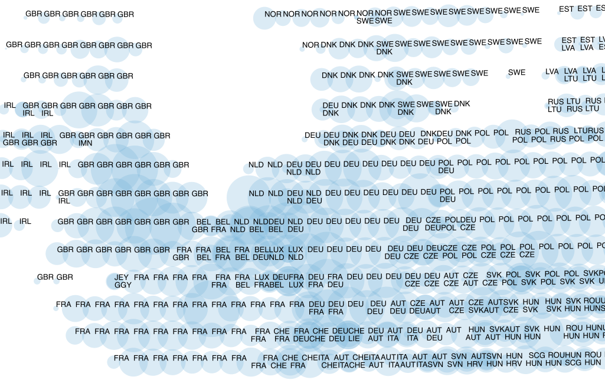

Population
==========

Data and experiments with world population densities for comparison to addresses.
More information at this post: http://mike.teczno.com/notes/openaddr/population-comparison.html

Includes gridded population data from two datasets,
[Gridded Population of the World (GPW), v4](http://beta.sedac.ciesin.columbia.edu/data/collection/gpw-v4)
(2015, UN-adjusted) in `data/gpwv4-2015.csv.gz` and
[Geographically Based Economic Data 4.0](http://gecon.yale.edu/data-and-documentation-g-econ-project)
(2005) in `data/gecon.csv.gz`.

GPWv4 Estimate
-----

Contents of `data/gpwv4-2015.csv.gz` derived from `gpw-v4-population-count-adjusted-to-2015-unwpp-country-totals_2015.tif`
raster dataset, available at http://beta.sedac.ciesin.columbia.edu/data/set/gpw-v4-population-count-adjusted-to-2015-unwpp-country-totals/data-download

Columns:

* `iso_a2`, `iso_a3`: [ISO 2-letter](https://en.wikipedia.org/wiki/ISO_3166-1_alpha-2)
   and [3-letter country code](https://en.wikipedia.org/wiki/ISO_3166-1_alpha-3).
* `lat`, `lon`: southwest corner of grid square.
* `size`: size of grid square, `1.0` or `0.1`.
* `year`: GPWv4 population estimate year.
* `population`: Number of people in this grid square.

Sample rows:

|  iso_a2 | iso_a3 | lat    | lon   | size | year | population   |
|---------|--------|--------|-------|------|------|--------------|
|  FJ     | FJI    | -180.0 | -20.0 | 1.0  | 2015 | 1.407        |
|  US     | USA    | -180.0 | 51.0  | 1.0  | 2015 | 0.0          |
|  RU     | RUS    | -180.0 | 65.0  | 1.0  | 2015 | 78.736       |

1,583,241 total rows: 21,018 at size `1.0` and 1,562,223 at size `0.1`.

`data/gpwv4-2015-merc.csv.gz` is a variation on `data/gpwv4-2015.csv.gz`, with population
calculated for [web mercator map tiles](http://wiki.openstreetmap.org/wiki/Slippy_map_tilenames)
instead of lat/lon squares.

Columns:

* `iso_a2`, `iso_a3`: [ISO 2-letter](https://en.wikipedia.org/wiki/ISO_3166-1_alpha-2)
   and [3-letter country code](https://en.wikipedia.org/wiki/ISO_3166-1_alpha-3).
* `z`, `x`, `y`: coordinate location.
* `year`: GPWv4 population estimate year.
* `population`: Number of people in this grid square.

Sample rows:

|  iso_a2 | iso_a3 | z | x   | y   | year | population  |
|---------|--------|---|-----|-----|------|-------------|
|  FJ     | FJI    | 8 | 0   | 139 | 2015 | 2250.198    |
|  US     | USA    | 8 | 16  | 54  | 2015 | 4713.011    |
|  RU     | RUS    | 8 | 169 | 20  | 2015 | 5.305       |

850,333 total rows: 17,702 at zoom `8` and 832,631 at zoom `11`.

G-Econ Estimate
------

Contents of `data/gecon.csv.gz` derived from `Gecon40_post_final.xls` spreadsheet,
available at http://gecon.yale.edu/data-and-documentation-g-econ-project

Columns:

* `iso_a2`, `iso_a3`: [ISO 2-letter](https://en.wikipedia.org/wiki/ISO_3166-1_alpha-2)
   and [3-letter country code](https://en.wikipedia.org/wiki/ISO_3166-1_alpha-3).
* `lat`, `lon`: southwest corner of grid square.
* `year`: G-Econ population estimate year.
* `population`: Number of people in this grid square.

Sample rows:

|  iso_a2 | iso_a3 | lat | lon  | year | population  |
|---------|--------|-----|------|------|-------------|
|  BA     | BIH    | 42  | 19   | 2005 | 0           |
|  BR     | BRA    | -32 | -57  | 2005 | 90.7543     |
|  BR     | BRA    | -25 | -56  | 2005 | 78.0909     |

21,170 total rows.
